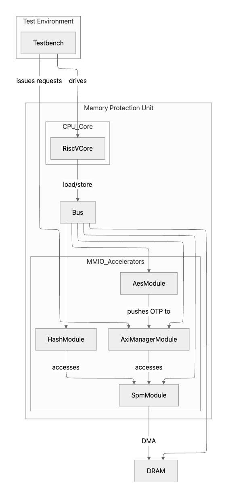

# ソフトウェアディファインドメモリ整合性検証アクセラレータ spike シミュレーション
このプロジェクトは、RISC-Vコアによるソフトウェア制御と専用ハードウェアアクセラレータを用いて、メモリの暗号化と整合性検証を提供するシステムのソフトウェアシミュレーションです。

## システム概要
本システムは、LLC（ラストレベルキャッシュ）とDRAMの間に位置し、64B単位のメモリアクセスに対して暗号化と整合性保証を透過的に提供する。
- AES-CTRを用いた64B単位の暗号化
- FNV-1aハッシュを用いた整合性検証
- 32分木構造の認証木によるリプレイ攻撃耐性

## 構成
main.cにコアによる制御のコードがある。
- メモリ保護領域
    - 保護領域: 64MB (0x0000_0000 - 0x03FF_FFFF)
- キャッシュライン: 1M個 (64B/ライン)
- タグ: 8B/ライン (合計8MB)
- カウンターライン: 32K個 (32分木、高さ4)
- 認証木
    - 32分木 (各ノードが32子を持つ)
    - 高さ4 (ルート + 3レベルの中間ノード + リーフノード)
    - 各ノードは64Bの
- カウンターライン
    - 各カウンターラインは32個のカウンターを格納
    - 1カウンターあたりのサイズ:　(メジャーカウンター 64bit + マイナーカウンター 8bit)
- スクラッチパッドメモリ (SPM): 4KB (64B/ライン、合計64ライン)
    - 56ラインをデータラインとして使用
    - 8ラインを管理領域として使用
    - 0: ルート (Root)
    - 1: 暗号文データ
    - 2: データタグ
    - 3: カウンター (レベル4)
    - 4-6: ツリーノード (レベル3-1)
    - 管理領域: 8ライン (64B)
        - 各データラインに対応する管理情報 (タグ、dirty/validビット) を格納
        - | タグ(58bit) | 未使用(4bit) | dirty(1bit) | valid(1bit) |


# セットアップ
RISC-Vの命令シミュレータであるspikeをサブモジュールとして利用し、パッチを適用する。

1. リポジトリのクローン
```
git clone <this_repository_url>
cd <repository_name>
```
2. サブモジュールの初期化とパッチの適用
以下のスクリプトを実行すると、サブモジュール（Spike）の取得と、プロジェクト固有の変更（パッチ）の適用が自動的に行われる。
Bash
```
./setup.sh
```

## ビルドと実行
1. spikeのビルド
```
cd spike
mkdir build
cd build
../configure
make
```

2. プロジェクトのコンパイルと実行
riscv64-unknown-elf-gccを使用して、プロジェクトのソースコードをコンパイルする。
```
cd spike_simulation
(コンパイル)
../spike/build/spike <binary_file>
```


<!-- 構成
- 64B単位の暗号化と整合性検証
- 64B単位のメモリアクセスを受け取り、暗号化と整合性保証を行う 
- 全部で64MBの保護領域 0x0000_0000-0x03FF_FFFF
    - 1M個のキャッシュライン
    - 32K個のカウンターライン
    - 32分木なら高さ4
        - root : 8B
        - height_1 : 32(1line),64B
        - height_2 : 1024(32line),2KB
        - height_3 : 32768(1024line),64KB
        - height_4 : _(),2MB
        - アドレス的には|height_4|height_3|height_2|height_1
- タグは8B、総量は8MB
- SPMは4096B=4KB容量
    - 64Bごとの保存・格納
    - 8Bで1ラインの情報管理
        - |タグ(58bit)|未使用(4bit)|dirty(1bit)|valid(1bit)|
    - 56line使用可能
    - 0line:root
    - 1line:暗号文
    - 2line:タグ
    - 3line:暗号用カウンター(height_4)
    - 4line-6line:height_3-height_1
    - 56-63line:管理ビット
- カウンターライン内のカウンターの構成
    - カウンターが32個入る
    - major counter:64bit
    - minor counter:8bit,8*32=256
    - tagのために64bit空いている
- ツリーのルートはSPM内に保存
- Hashアルゴリズム：FNV-1a 64bit
- 暗号化アルゴリズム：AES-CTR 128bit
- riscv_core.hppに検証認証アルゴリズムを書いている
    - どちらのアルゴリズムもrootまで辿っている -->

<!-- システム概要の図を貼りたい -->
